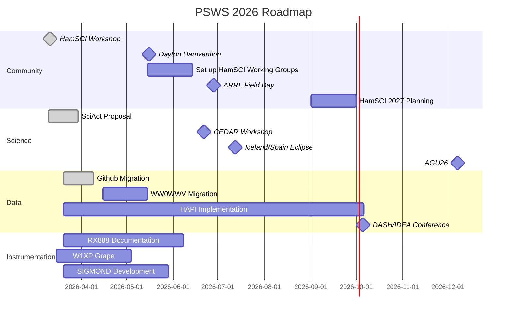

```mermaid
gantt
    title PSWS 2026 Roadmap
    dateFormat YYYY-MM
section Community
        HamSCI Workshop       : done, milestone, hamsci, 2026-03-10, 2d 
        Dayton Hamvention       : milestone, hamvention, 2026-05-15, 2d
        Set up HamSCI Working Groups       : wg, 2026-05-15, 30d
        ARRL Field Day       : milestone, fieldday, 2026-06-27, 2d
        %% K3LR Retreat (TBD):        k3lr, 2026-07-27, 2d
        HamSCI 2027 Planning       : planning, 2026-09-01, 30d 
                                
section Science
       SciAct Proposal    :done, sciact, 2026-03-10, 20d
        CEDAR Workshop    : milestone, CEDAR, 2026-06-21, 1d 
        Iceland/Spain Eclipse       : milestone, Eclipse, 2026-07-12, 1d
AGU26       : milestone, AGu26, 2026-12-07, 1d 
section Data
        Github Migration    :done, req1, 2026-03-20, 20d
                WW0WWV Migration    :ww0wwv, 2026-04-15, 30d
                HAPI Implementation    :hapi, 2026-03-20, 200d
       DASH/IDEA Conference      : milestone, DASH, 2026-10-05, 1d

                
section Instrumentation
        RX888 Documentation    :rx888, 2026-03-20, 80d
        W1XP Grape :rx888, 2026-03-15, 50d
        SIGMOND Development    :sigmond, 2026-03-20, 70d

```
