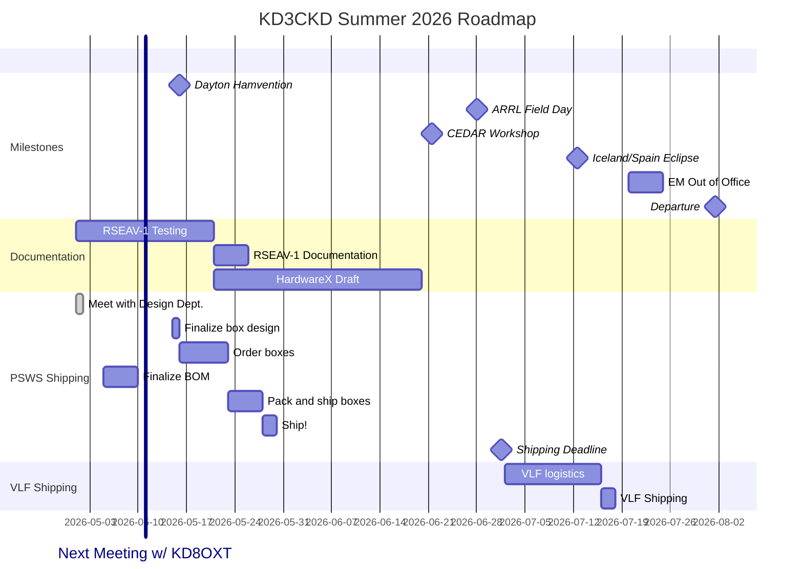

## TO-DO List
- [X] Start a to-do list
- [X] Order antenna and timing injectors
- [ ] Order parts 
- [ ] Get status updates on all the instruments!
    - [ ] WSPRsonde
    - [ ] Ground mag
    - [ ] Antenna and timing injectors

      

## KD3CKD/KD8OXT - Agenda items for next meeting
- Ticketing system
- RX888 updates
- Box design updates (and PSWS logo)
- HardwareX manuscript
- Smart outlet spec (https://github.com/HamSCI/psws-charette/issues/46)
